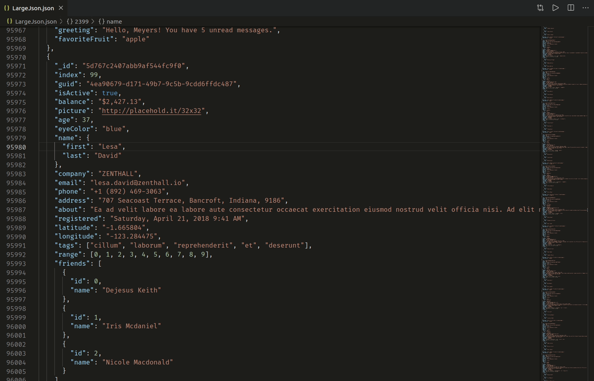

# [jsonpath](https://github.com/dchester/jsonpath) extension for [Visual Studio Code](https://code.visualstudio.com/)

Use [JSONPath expressions](https://github.com/dchester/jsonpath#jsonpath-syntax) to extract and filter data from JSON objects.

Check out https://github.com/stedolan/jq/wiki/For-JSONPath-users for a comparison between JSONPath and [jq](https://stedolan.github.io/jq/).

## Features

Two commands are available through the [command palette](https://code.visualstudio.com/docs/getstarted/userinterface#_command-palette).

With a .json file open, type `jsonpath` to bring up the commands, key in your JSON path, then press Enter to view filter results.

## Commands

### `jsonPath: Extract JSON data`

Filter JSON data.

### `jsonPath: Extract JSON data with their paths`

Filter JSON data and display the path to filtered data.

## Dependencies

- [JSONPath library](https://github.com/dchester/jsonpath) from dchester: Query and manipulate JavaScript objects with JSONPath expressions. Robust JSONPath engine for Node.js.
