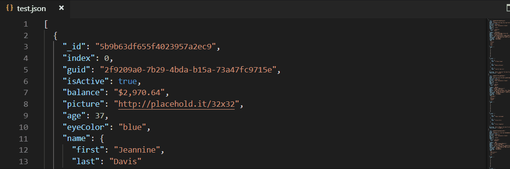

# [jsonpath](https://github.com/dchester/jsonpath) extension for [Visual Studio Code](https://code.visualstudio.com/)

Use [JSONPath expressions](https://github.com/dchester/jsonpath#jsonpath-syntax) to extract and filter data from JSON objects.

## Features
Two commands are available through the [command palette](https://code.visualstudio.com/docs/getstarted/userinterface#_command-palette). Type `jsonpath` to bring them up:

- Extract JSON data: real-time results of JSONPath queries. For JSON files

- Extract JSON data with their paths: real-time results of JSONPath queries, together with path to matches. For JSON files.

- Also supports searching for any highlighted JSON-formatted text, regardless of file type.

## Dependencies
- [JSONPath library](https://github.com/dchester/jsonpath) from dchester: Query and manipulate JavaScript objects with JSONPath expressions. Robust JSONPath engine for Node.js.