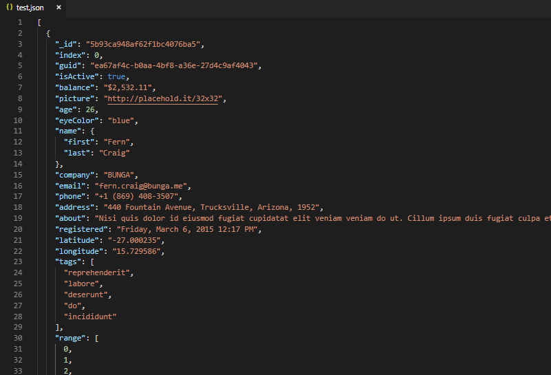

# [jsonpath](https://github.com/dchester/jsonpath) extension for [Visual Studio Code](https://code.visualstudio.com/)

Use [jsonpath queries](https://github.com/dchester/jsonpath#jsonpath-syntax) to extract data from JSON objects.

## Features
- Real-time results of JSONPath queries in any JSON file.
- Also supports any highlighted JSON-formatted text, regardless of file type.

## Dependencies
- [JSONPath library](https://github.com/dchester/jsonpath) from dchester: Query and manipulate JavaScript objects with JSONPath expressions. Robust JSONPath engine for Node.js.